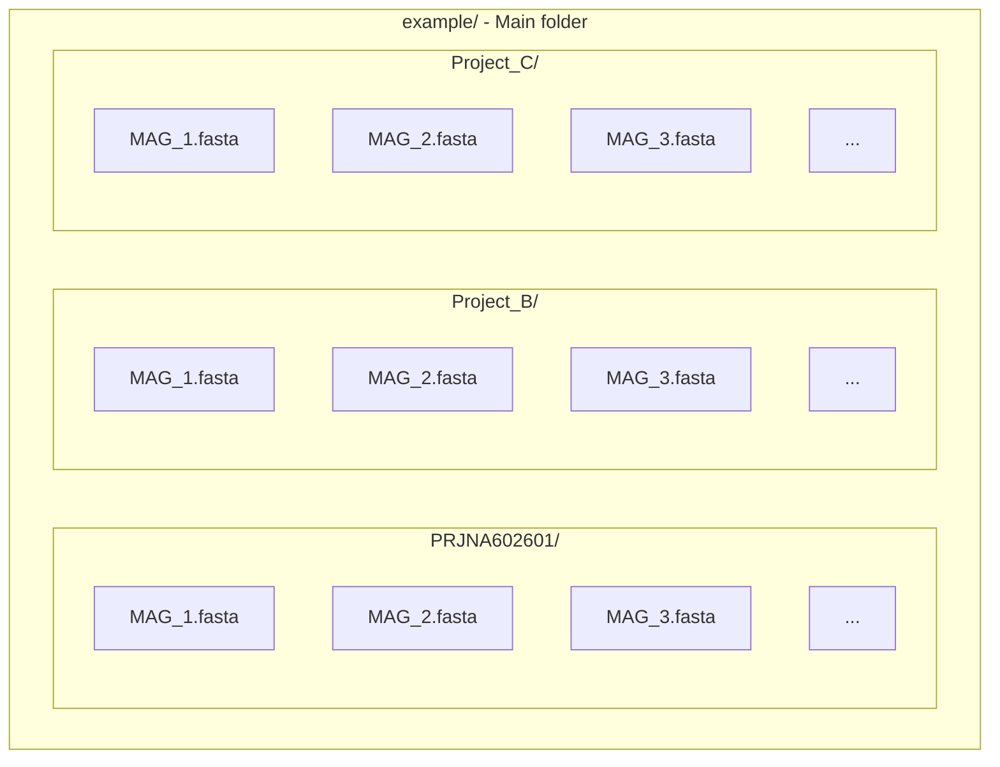

# Krill

## :mag_right: SUMMARY
1. :scroll: ABOUT
2. :electric_plug: PRE-REQUISITES
3. :dvd: INSTALLATION
4. :woman_teacher: PREPARING YOUR FILES
5. :woman_technologist: USING

## :scroll: ABOUT

## :electric_plug: PRE-REQUISITES
1. Ubuntu 20.04
2. Python 3.X
3. Docker or Conda
4. hmmsearch

## :dvd: INSTALL

<details><summary>INSTALLING AntiSMASH via Docker</summary>
<p>
    
1. Pull [AntiSMASH Docker Image](https://hub.docker.com/r/antismash/standalone)
    
```
docker pull antismash/standalone
```
    
2. Prepare AntiSMASH run scripts
    
```
mkdir ~/bin    # not required if you already have that
curl -q https://dl.secondarymetabolites.org/releases/6.1.1/docker-run_antismash-full > ~/bin/run_antismash
chmod a+x ~/bin/run_antismash
export PATH="$HOME/bin:$PATH"
```
    
3. Test installation
    
```
run_antismash . . --version
```
    
or
    
```
run_antismash . . --version
```
    
</p>
</details>

<details><summary>INSTALLING AntiSMASH via Conda</summary>
<p>
    
1. Install AntiSMASH using conda
    
```
conda install -c bioconda antismash
```

</p>
</details>

<details><summary>INSTALLING ARTS via Conda</summary>

<p>
    
1. Download environment spec list file from this repository (spec-file.txt)
    
2. Create a conda environment for ARTS using the spec list file
    
```
conda create -n "ARTS" --file /path/to/spec-file.txt
```
 
3. Download ARTS project into the conda environment using git
    
```
cd /path/to/ARTS/environment/
git clone https://bitbucket.org/ziemertlab/arts.git
```

</p>
    
</details>

## :woman_teacher: PREPARING YOUR FILES

Krill works in a single folder with it's fasta files or in a folder with different Projects MAGs (multiple folders). For this second option, it has to have a [specific folder organization](example/) to start the analysis:

> :warning: DO NOT USE SPACES IN FOLDERS AND FILES NAMES, IT CAN CAUSE ERRORS.

<details><summary>FOLDERS AND FILES STRUCTURE</summary>
<p>
    
#### Flowchart Scheme


#### Printscreen Scheme
<p align="center">
    
</p>
</p>
</details>
    
## :woman_technologist: USING
```
Krill [OPTIONS] PATH
```

```
usage: Krill [-h] [-noprep] [-t THREADS] [--citation] PATH

positional arguments:
  PATH                  Working path with fasta files

optional arguments:
  -h, --help            show this help message and exit
  -noprep, --do_not_prepare_fasta_files
                        Rename fasta files, its headers and store changes in a CSV file for control [DEFAULT: TRUE]
  -t THREADS, --threads THREADS
                        Trheads to use in analysis [DEFAULT: 16]
  --citation            Shows how to cite us
```
